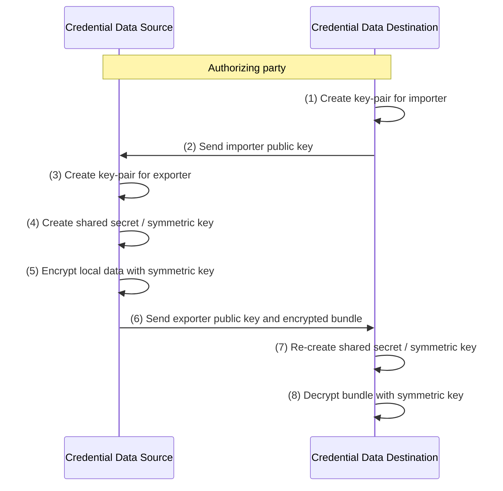

---
###
# Internet-Draft Markdown Template
#
# Rename this file from draft-todo-yourname-protocol.md to get started.
# Draft name format is "draft-<yourname>-<workgroup>-<name>.md".
#
# For initial setup, you only need to edit the first block of fields.
# Only "title" needs to be changed; delete "abbrev" if your title is short.
# Any other content can be edited, but be careful not to introduce errors.
# Some fields will be set automatically during setup if they are unchanged.
#
# Don't include "-00" or "-latest" in the filename.
# Labels in the form draft-<yourname>-<workgroup>-<name>-latest are used by
# the tools to refer to the current version; see "docname" for example.
#
# This template uses kramdown-rfc: https://github.com/cabo/kramdown-rfc
# You can replace the entire file if you prefer a different format.
# Change the file extension to match the format (.xml for XML, etc...)
#
###
title: The Credential Migration Protocol
abbrev: CRIMP
category: info

docname: draft-cpsig-crimp-latest
submissiontype: IETF
number:
date:
consensus: true
v: 3
area: AREA
workgroup: WG Working Group
keyword:
 - next generation
 - unicorn
 - sparkling distributed ledger
venue:
  group: WG
  type: Working Group
  mail: WG@example.com
  arch: https://example.com/WG
  github: USER/REPO
  latest: https://example.com/LATEST

author:
 -
    fullname: Nicholas Steele
    organization: 1Password
    email: nick.steele@1password.com

normative:

informative:

--- abstract

This specification defines a protocol to securely move one or more user credentials between two credential providing applications.

--- middle

# Introduction

Traditionally, local credential migration through credential managers was

# Conventions and Definitions

{::boilerplate bcp14-tagged}

# Flow Diagram

# Security Considerations

TODO Security

# IANA Considerations

This document has no IANA actions.

# Implementation Requirements
This section defines which algorithms and features of this specification are mandatory to implement. Applications using this specification can impose additional requirements upon implementations that they use.

--- back

# Acknowledgments
{:numbered="false"}

TODO acknowledge.
